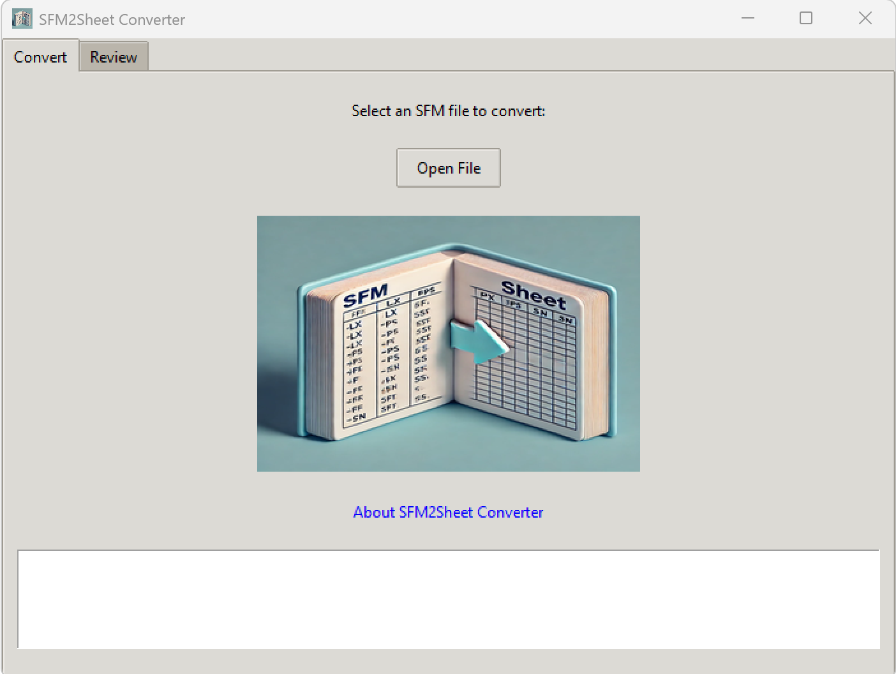

# SFM2Sheet Converter

A Python tool that converts **SFM (Standard Format Marker) files** into spreadsheet format (CSV/XLSX). This application provides a simple graphical interface to:

- **Open** an SFM file.
- **Preview** the parsed data in a table.
- **Export** the results to a `.xlsx` or `.csv` file.

> **Note:** This tool is effectively the **reverse** of [Sheet Swiper](https://github.com/sillsdev/sheetswiper), which converts **spreadsheets** into **SFM**. SFM2Sheet Converter takes **SFM** files and outputs **spreadsheets**.

---

## Screenshots

### Main Window

Below is the **Convert** tab, where you select an SFM file to convert:



- **Open File**: Choose an SFM file (or `.db` file) exported from FLEx or another tool.
- **About SFM2Sheet Converter**: Shows a small dialog with author and license info.
- A log panel appears below (the large white box) to display status and error messages.

### Review Tab

After loading a file, the app switches to the **Review** tab to display the parsed data:


- **Preview (first 10 rows)**: Shows the top 10 rows of the converted data.
- **Save the spreadsheet**: Exports the full data to `.xlsx` or `.csv`.
- **Choose display font**: Pick a font (e.g., Arial) to display special diacritics or scripts.

---

## How It Compares to Sheet Swiper

- **Sheet Swiper** (by SIL International) takes **spreadsheets** of linguistic data and converts them into **SFM**.
- **SFM2Sheet Converter** does the **opposite**: it takes **SFM** files (e.g., `.db`, `.sfm`, `.txt` with markers) and **outputs** a spreadsheet.

For more info on Sheet Swiper, see [its GitHub page](https://github.com/sillsdev/sheetswiper) and its MIT License. 

---

## Sample Files ##

To help you test:

1. **`Rangskat_lexicon-export_from-FLEx.db`**  
   - A sample SFM/FLEx `.db` file containing lexical data.  
   - Try loading this file in the **Convert** tab to see how the application processes SFM markers.

2. **`Rangskat_lexicon-export_from-FLEx.xlsx`**  
   - An example spreadsheet version of the same data, for reference.  
   - (Not needed by the app, but useful for comparison.)

---

## Installation / Usage ##

### 1. Using the Standalone `.exe` ###

1. [Download the `.exe` from Releases](../../releases) (if provided).
2. Place it anywhere on your computer.
3. **Double-click** `SFM2Sheet_Converter.exe` to run.
4. In the **Convert** tab:
   - Click **Open File** → choose an SFM file (e.g., `Rangskat_lexicon-export_from-FLEx.db`).
   - Observe the logs in the big white box below.
5. Switch to the **Review** tab to see a table preview of the first 10 rows.
6. Click **Save the spreadsheet** to export the entire data to `.xlsx` or `.csv`.

No separate Python installation is required.

### 2. Using Python Source ###

1. **Clone or download** this repository:
   ```bash
   git clone https://github.com/YourUser/SFM2Sheet-Converter.git
   cd SFM2Sheet-Converter
   
2. **Install dependencies**:
   ```bash
   pip install -r requirements.txt

3. **Run**:
   ```bash
   python sfm2sheet.py

4. The GUI will appear, allowing you to open an SFM file and preview/export data.

### How It Works ###
1. **Parse SFM**
The script reads each line of the SFM file, deciding if it’s an entry-level or sense-level marker, storing repeated markers in lists.
2. **Flatten Data**
Multiple senses become additional columns; repeated markers become repeated columns.
3. **Preview & Save**
You can see the first 10 rows in the Review tab and save the entire dataset to .xlsx or .csv.

### Building Your Own .exe ###
If you modify the code and want to create a new standalone .exe:

1. **Install PyInstaller:**
    ```bash   
   pip install pyinstaller

2. **Build (including your logo file):**
    ```bash
   python -m PyInstaller --onefile --windowed sfm2sheet.py --add-data "SFM2Sheet-Converter_logo.png;."

3. The output appears in the dist/ folder as sfm2sheet.exe (or similar).

## Troubleshooting ##

### Logo Not Showing ###
Ensure you used `--add-data` in PyInstaller and that the code references the image with a helper function like `resource_path("SFM2Sheet-Converter_logo.png")`.

### No Data in Review ###
Confirm your SFM file has lines starting with `\marker`. Blank lines or lines without `\` are ignored.

### Export Fails
Make sure you have permission to write to the selected folder and that no antivirus is blocking the `.exe`.

---

## Contributing ##

1. **Fork** the repository and create a new branch:
      ```bash
      git checkout -b feature/myFeature
   
2. Commit your changes:
     ```bash
      git commit -am 'Add a new feature'

3. **Push** to your fork:
     ```bash
      git push origin feature/myFeature

4. Create a Pull Request on the main repo.

## Developer ##
Developed by **[Maaz Ahmad Shaikh](https://maazahmadshaikh.github.io/)** for converting FLEx or SFM-based lexicon files into spreadsheet form.

**Special Mention**: Sheet Swiper by SIL International, which does the reverse conversion (spreadsheets → SFM).
